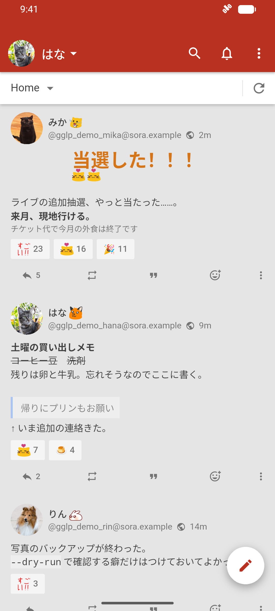
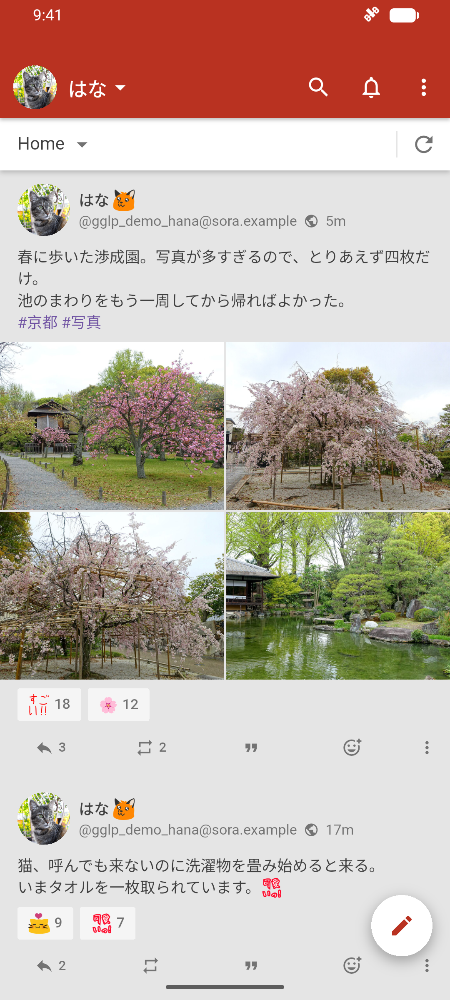
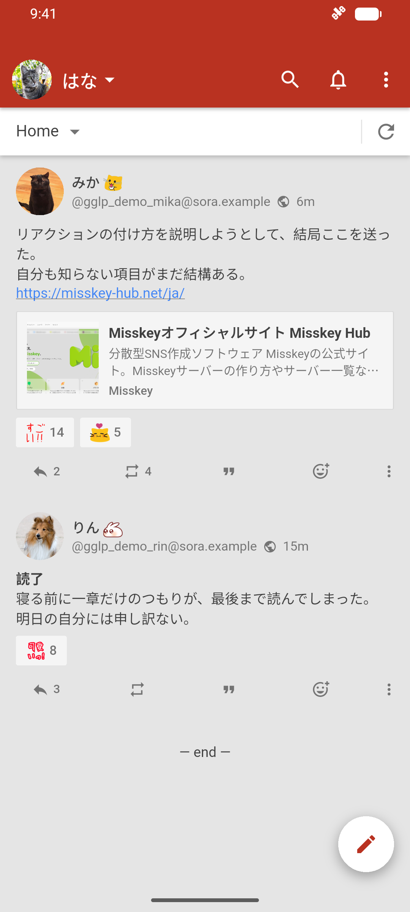
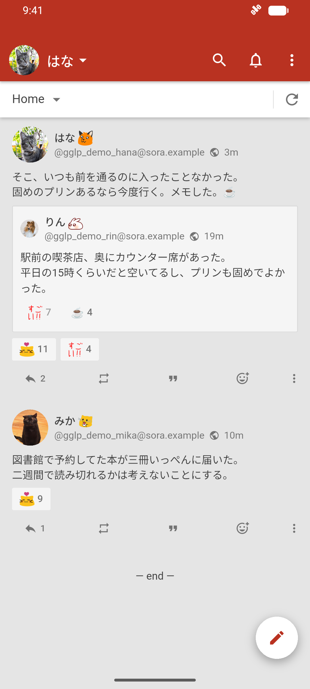
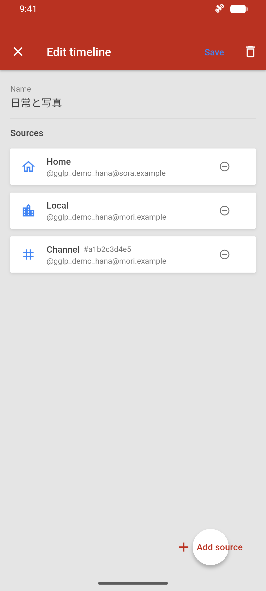
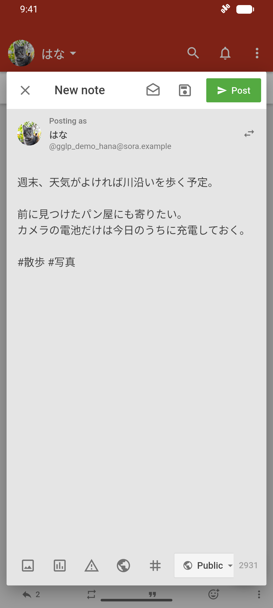

# GGLP

A Flutter client for Misskey with multiple accounts, combined timelines, MFM,
custom emoji, reactions, channels, and media posting. GGLP is an independent
client; it is not affiliated with Misskey's server operators.

## Screenshots

| MFM formatting | Photo grids | Link previews |
| --- | --- | --- |
| [](screenshots/09-mfm-ja.png) | [](screenshots/02c-four-photos-ja.png) | [](screenshots/03-links-ja.png) |
| **Quote notes** | **Custom timelines** | **Note composer** |
| [](screenshots/04-quotes-ja.png) | [](screenshots/06-custom-editor-ja.png) | [](screenshots/07-compose-ja.png) |

Screenshots use Japanese demo posts, fictional accounts and server names.

<details>
<summary>Screenshot media credits</summary>

- Server emoji come from the public [misskey.io](https://misskey.io/api/emojis), [misskey.art](https://misskey.art/api/emojis), and [misskey.systems](https://misskey.systems/api/emojis) catalogs. Their artwork belongs to its respective creators and is not covered by GGLP's MIT license.
- Kyoto photographs: Daderot, CC0 ([garden](https://commons.wikimedia.org/wiki/File:Cherry_blossoms_-_Sh%C5%8Dsei-en_-_Kyoto,_Japan_-_DSC07031.jpg), [tree](https://commons.wikimedia.org/wiki/File:Cherry_blossoms_-_Sh%C5%8Dsei-en_-_Kyoto,_Japan_-_DSC06878.jpg), [cherry tree](https://commons.wikimedia.org/wiki/File:Cherry_blossoms_-_Sh%C5%8Dsei-en_-_Kyoto,_Japan_-_DSC06868.jpg), [garden pond](https://commons.wikimedia.org/wiki/File:Tekisui-ken_and_Ingetsu-chi_Pond_-_Sh%C5%8Dsei-en_-_Kyoto,_Japan_-_DSC06894.jpg)).
- Profile photographs: [Pavel Kovalev](https://commons.wikimedia.org/wiki/File:Portrait_of_a_cat1.jpg), [HJAndrews](https://commons.wikimedia.org/wiki/File:BAPhoto-Portrait.jpg), and [Karen Arnold](https://commons.wikimedia.org/wiki/File:Dog-portrait-1367008135LpJ.jpg), CC0.
- The [Misskey Hub](https://misskey-hub.net/ja/) card uses the site's published preview title, description and thumbnail; © its respective creators, including the Misskey Project.

</details>

## Install

Download the universal APK from [GitHub Releases](https://github.com/pentaCoxian/gglp/releases).
Android 5.0 (API 21) or later is required. Android will ask you to allow your
browser to install apps from this source. The release includes SHA-256 checksums.

The OSS app uses `io.pentacoxian.gglp`, so it can coexist with development builds
using another package ID. Accounts and drafts are separate between those apps.
Sign in through your chosen Misskey server; the browser returns via `gglp://miauth`.

## Updates and privacy

On Android, GGLP checks GitHub's latest stable release at most once daily while
foregrounded. Disable **Automatic update checks** in Settings to prevent these
automatic requests; **Check for updates** remains available. Update checks send
ordinary network request metadata to GitHub, not your Misskey credentials.

Downloading and installing an update always requires your action. GGLP checks
its size, SHA-256, package/version and APK signature, then opens Android's
installer. Android may first ask you to allow GGLP to install apps. Installation
is not silent. Only APKs signed with the same release key can update an install.

Credentials and preferences are stored locally. Posts, media and account requests
go to the Misskey server you choose, which applies its own privacy policy.
Remote media and previews can contact the hosts referenced by that content.
GGLP does not include an analytics or advertising service. Review the server's
terms and use test accounts when testing posting or moderation features.

## Develop

Use Flutter **3.29.2** / Dart **3.7.2**. The Android build uses JDK **17**, SDK
**36**, NDK **27.0.12077973**, AGP **8.9.1**, and Gradle **8.11.1**.

```sh
flutter pub get --enforce-lockfile
flutter analyze
flutter test
flutter run
```

Generated Dart models/database files are committed. After changing their inputs:

```sh
dart run build_runner build --delete-conflicting-outputs
```

The existing iOS, macOS, Windows and Linux runners are retained. APK releases and
the installer integration target Android; other platforms have no automatic
installer. Configure your own Apple signing team when building for Apple devices.
The icon source and regeneration instructions are in `assets/branding`.

Contributions should stay focused and include tests for behavior changes. Run
analysis and tests before opening a pull request. Report reproducible bugs through
[GitHub Issues](https://github.com/pentaCoxian/gglp/issues), without account tokens,
private media, passwords or other sensitive data.

## Build and release APKs

Debug APKs need no signing secrets:

```sh
flutter build apk --debug
```

Release builds require an independently backed-up signing key. Create an ignored
`android/key.properties` file with local values:

```properties
storeFile=/absolute/path/to/release.jks
storePassword=<private password>
keyAlias=release
keyPassword=<private password>
```

```sh
flutter build apk --release
```

Never commit the keystore or passwords. A lost release key prevents compatible
updates to installed APKs. Debug-signed APKs cannot update release-signed APKs.

Pull requests and `main` run tests and produce debug APK artifacts for 14 days.
A `v<version>` tag on a commit from `main` builds a signed universal APK and
publishes a GitHub Release after validation. The tag must match `pubspec.yaml`;
the build number must increase for each release. Start with `0.9.1+11` / `v0.9.1`.

The canonical release workflow uses GitHub Actions secrets:

- `ANDROID_KEYSTORE_BASE64`
- `ANDROID_KEYSTORE_PASSWORD`
- `ANDROID_KEY_ALIAS`
- `ANDROID_KEY_PASSWORD`

These are available only to the release signing job, never fork pull requests.
Release assets include the APK, `SHA256SUMS`, and `update.json`, generated from
the built APK. Files are uploaded to a draft release and verified before it
becomes visible to update checks. Published releases are not overwritten.

Forks must use their own signing key and configure their release repository;
otherwise they must disable the updater. Change the updater repository constant in
`lib/app/updates/update_manifest.dart` to your fork before building. Keep GitHub credentials out of the application.

## License

Project-owned code is [MIT licensed](LICENSE). See
[third-party notices](THIRD_PARTY_NOTICES.md) and Settings → Licenses for dependency
licenses, including the bundled Roboto font license.
